# gla-igr-msc-project

This is the degree project for *MSc in Astrophysics* at *University of Glasgow*.

- Initialized: May 30, 2023
- Editted: August 23, 2023

[//]: # "========================================================================"

## Purpose

Use normalizing flow for approximating gravitational wave template bank density

### Working scripts

- Template density for polarized GW waveform with respect to $\mathcal{M}$ and $\eta$
- Normalizing flow script - *under maintainance*

### Work in progress

- Normalizing flow script
- NF script packaging into vi_* files

[//]: # "========================================================================"

## Requirements

### Environment

- ```WSL: Ubuntu```
- ```Python 3.10```

### Dependecies

- ```jax```
- ```ripplegw```
- ```bilby```
- ```haiku```
- ```distrax```
- ```optax```
- ```scienceplots```

[//]: # "========================================================================"

## Theory background

### Waveform parameters

```python
# GW150914 Mock Param
m1, m2, s1, s2, dl, tc, phic, theta, phi = (
    36.0, 29.0, 0.0, 0.0, 40.0, 0.0, 0.0, 0.0, 0.0,
)
# Param for ripple waveform generation
mc, eta, s1, s2, dl, tc, phic, theta, phi = (
    28.0956, 0.2471, 0.0, 0.0, 40.0, 0.0, 0.0, 0.0, 0.0,
)
```

The vectorized waveform parameter is:
$$
\vec{\Theta}
= \left[~\mathcal{M},~\eta,~s_1,~s_2,~d_L,~t_c,~\phi_c,~\theta,~\phi~\right]^{\top}
$$
with chirp mass:
$$\mathcal{M}
= \frac{\left(m_1m_2\right)^{3/5}}{\left(m_1+m_2\right)^{1/5}}$$
and symmetric mass ratio:
$$
\eta
= \frac{\left(m_1m_2\right)}{\left(m_1+m_2\right)^{2}}
$$

### Template bank density

The one side noise weighted inner product is:
$$
\braket{d|h}
= 4\Re{
    \int_{f_{\text{min}}}^{f_{\text{max}}}
    \frac{\tilde{d}^{\ast}\tilde{h}}{S(f)}df
}
= 4\delta f\Re{\sum_i\frac{\tilde{d}_i^{\ast}\tilde{h}_i}{S(f)_i}}
$$

A normalized waveform template follow:
$$h = \mathcal{A}\hat{h}, ~\text{with}~ \bra{\hat{h}}\ket{\hat{h}} = 1$$

That is, the FIM $\mathcal{I}_{(i, j)}$ is:
$$
\mathcal{I}_{(i, j)}
= \exp\left[\braket{\tilde{h}_i|\tilde{h}_j}\right]
= \exp\left[
    4\Re{\int_{f_{\text{min}}}^{f_{\text{max}}}
    \frac{{\tilde{h}_i}^{\ast}{\tilde{h}_j}}{S(f)}df}
\right]
= \exp\left[
    4\Re{\delta f
    \cdot\sum\left[\frac{{\tilde{h}_i}^{\ast}{\tilde{h}_j}}{S(f)}\right]}
\right]
$$

A metric can therefore be denoted as:
$$
\tilde{g}_{ij}
= \braket{
    \frac{\partial\hat{h}}{\partial\Theta_i}
    |\frac{\partial\hat{h}}{\partial\Theta_j}
}
= \braket{\partial_i\hat{h}|\partial_j\hat{h}}
$$

Where a projection of $\mathcal{I}_{(i, j)}$ onto $\phi_c$ gives:
$$
\gamma_{pq}
= \tilde{g}_{pq} - \frac{
    \tilde{g}_{\phi_c}\tilde{g}_{q\phi_c}
    }{
        \tilde{g}_{\phi_c\phi_c}
}
= \left[
    \braket{\partial_p\hat{h}_0|\partial_q\hat{h}_0}
    -\braket{\partial_p\hat{h}_0|\hat{h}_{\frac{\pi}{2}}}
    \braket{\partial_q\hat{h}_0|\hat{h}_{\frac{\pi}{2}}}
\right]
$$

Projecting back onto $t_c$ yields the correct template bank density:
$$
g_{kl}
= \gamma_{kl} - \frac{\gamma_{{t_c}k}\gamma_{{t_c}l}}{\gamma_{{t_c}{t_c}}}
$$

[//]: # "========================================================================"

## File structure

```bash
.
├── LICENSE
├── README.md
├── data
│   ├── __init__.py
│   ├── __jaxcache__
│   ├── __pycache__
│   ├── gw_cfg.py
│   ├── gw_fim.py
│   ├── gw_plt.py
│   ├── gw_rpl.py
│   ├── vi_cfg.py
│   ├── vi_cls.py
│   ├── vi_dat.py
│   └── vi_plt.py
├── figures
├── legacy
├── main.py
├── test.py
└── results
```

[//]: # "========================================================================"

## Sample run

```python
# Library import
# Set XLA resource allocation
import os
# Use jax and persistent cache
from jax.experimental.compilation_cache import compilation_cache as cc
# Custom packages
from data import gw_fim, gw_plt, gw_rpl
from data.gw_cfg import f_sig, f_psd, mcs, etas, test_params
# Setup
os.environ['XLA_PYTHON_CLIENT_PREALLOCATE'] = 'false'
cc.initialize_cache("./data/__jaxcache__")

# First compilation
# Wavefor generation
hp = gw_rpl.waveform_plus_restricted(test_params, f_sig)
hc = gw_rpl.waveform_cros_restricted(test_params, f_sig)
# Gradient calculation
gp = gw_rpl.gradient_plus(test_params)
gc = gw_rpl.gradient_cros(test_params)
# FIM test statistics calculation
detp = gw_fim.log10_sqrt_det_plus(test_params)
detc = gw_fim.log10_sqrt_det_cros(test_params)
# First compilation - results checker
print(f"Test waveform hp.shape:{hp.shape} hc.shape:{hc.shape}")
print(f"Test gradient gp.shape:{gp.shape} gc.shape:{gc.shape}")
print(f"Test log10 density detp:{detp:.4g} detc:{detp:.4g}")

# FIM density calc params
fim_param = gw_fim.fim_param_build(mcs, etas)
print(f"fim_param.shape:{fim_param.shape}")

# Density matrix batching
density_p = gw_fim.density_batch_calc(
    fim_param, mcs, etas, batch_size=100, waveform="hp")
density_c = gw_fim.density_batch_calc(
    fim_param, mcs, etas, batch_size=100, waveform="hc")
print(f"Metric density_p.shape:{density_p.shape}")
print(f"Metric density_c.shape:{density_c.shape}")

# Plot Generation
gw_plt.ripple_waveform(f_sig, hp, waveform="hp")
gw_plt.ripple_waveform(f_sig, hc, waveform="hc")
gw_plt.ripple_gradient(f_sig, hp, hc, param="mc")
gw_plt.ripple_gradient(f_sig, hp, hc, param="eta")
gw_plt.bilby_noise_psd(f_sig, f_psd)
gw_plt.log_fim_contour(mcs, etas, density_p, waveform="hp")
gw_plt.log_fim_contour(mcs, etas, density_c, waveform="hc")

```

[//]: # "========================================================================"

## Figures

### Active figures

- GW150914 simulated waveform with ```ripple.waveforms.IMRPhenomXAS.gen_IMRPhenomXAS_polar```

> 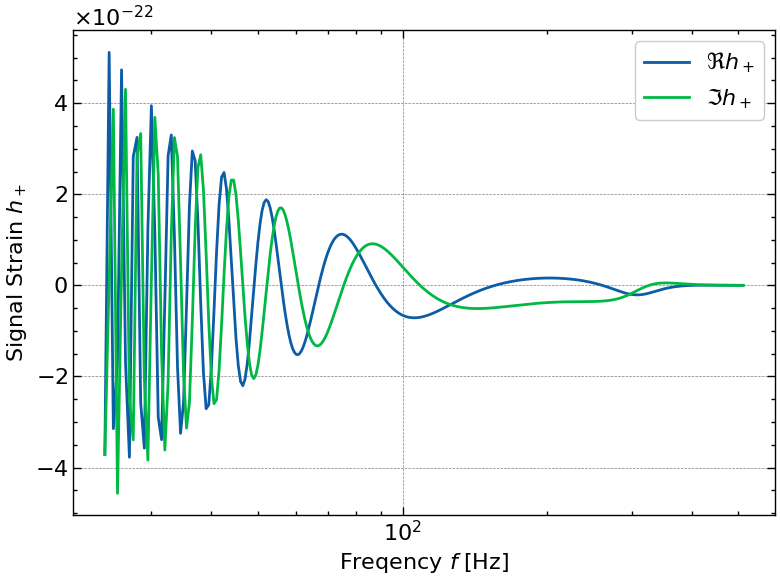
> 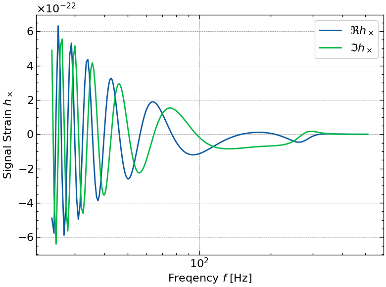

- GW150914 simulated gradient with ```jax.vmap(jax.grad())```

> 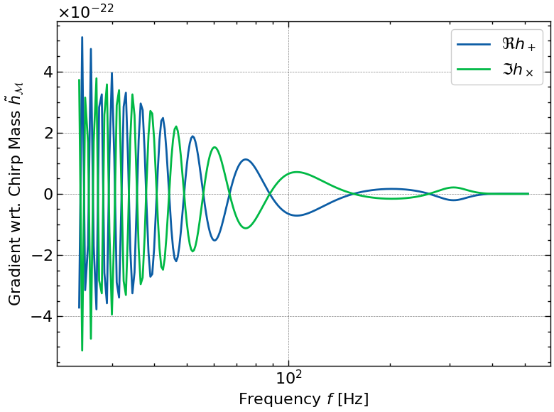
> 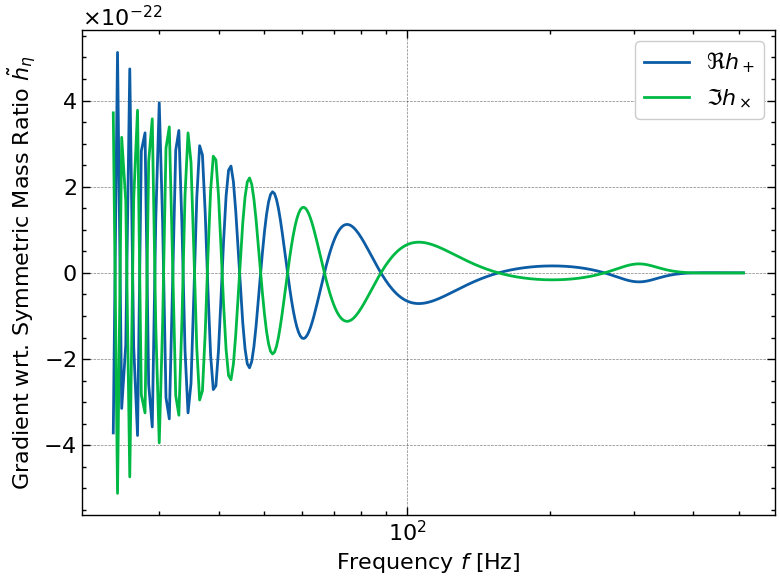

- Power Spectral Density of aLIGO from ```bilby```

> 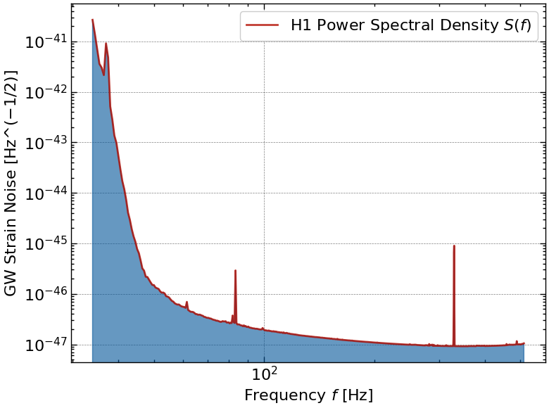

- Log template density

> 
> 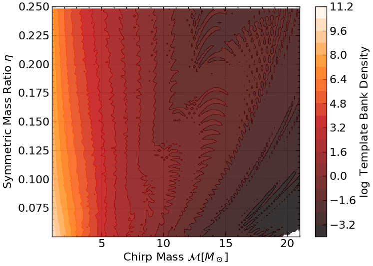

- Log template density at different range

> 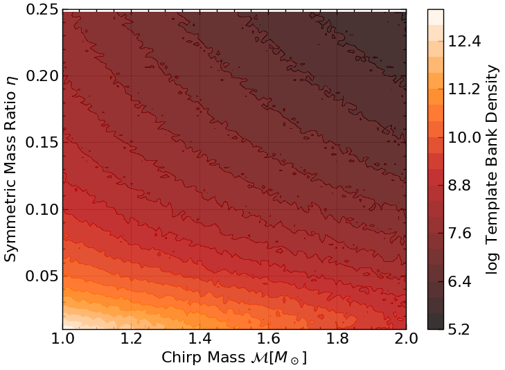
> 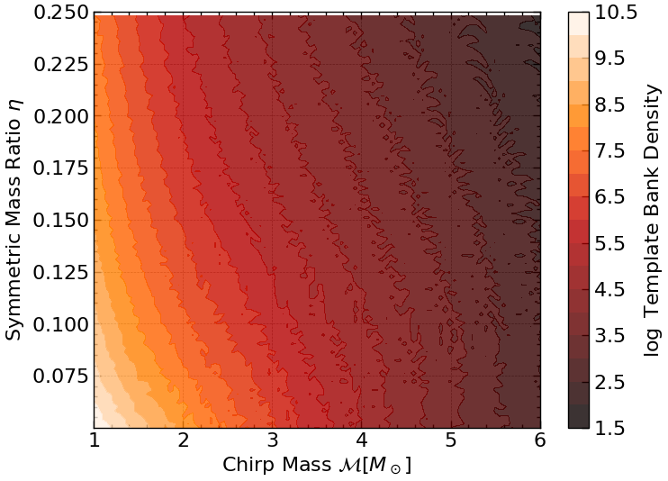
> 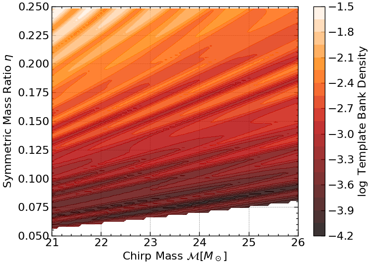
> 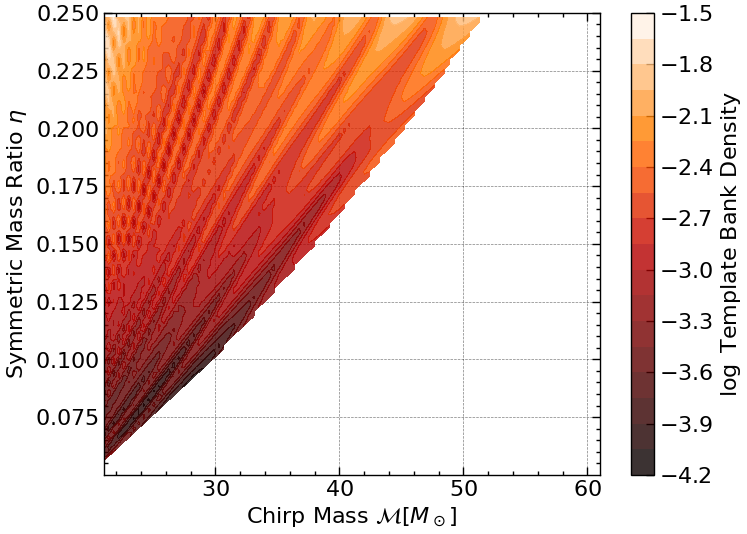

- Normalising flow test

> 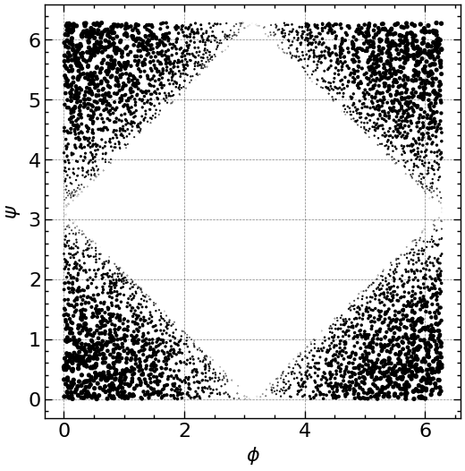
> 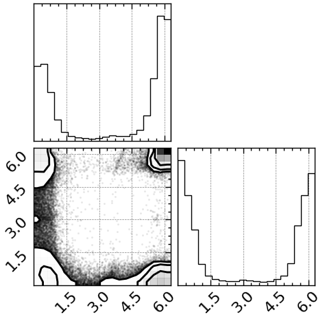

- Normalising flow training

> 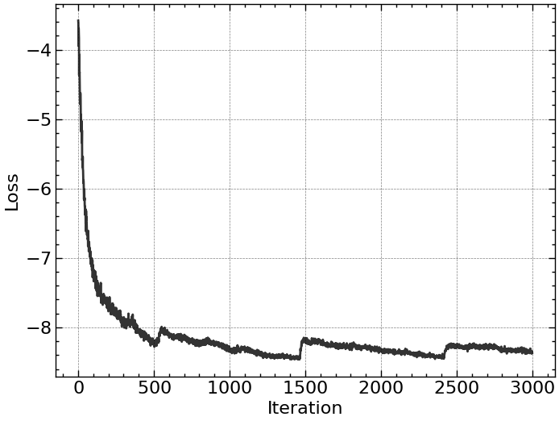
> 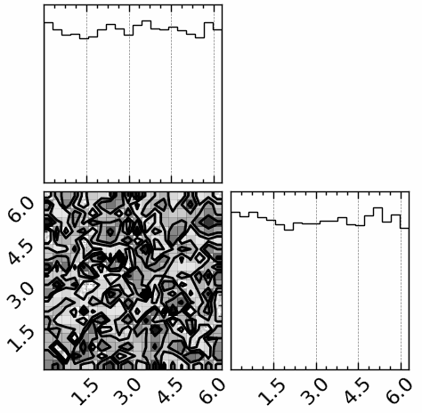

### Legacy figures

- GW150914 waveform generated with ```ripplegw```

> 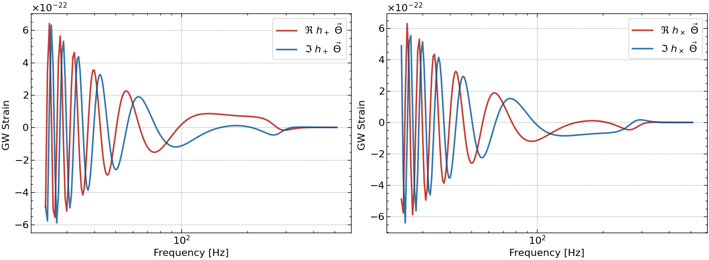

- GW150914 waveform gradient plot with ```jax.vmap(jax.grad())```

> 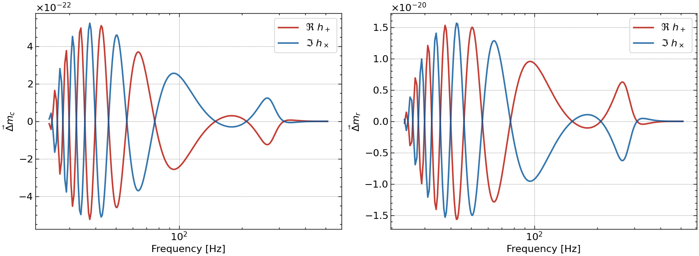

- PSD aLIGO noise curve with ```bilby```

> 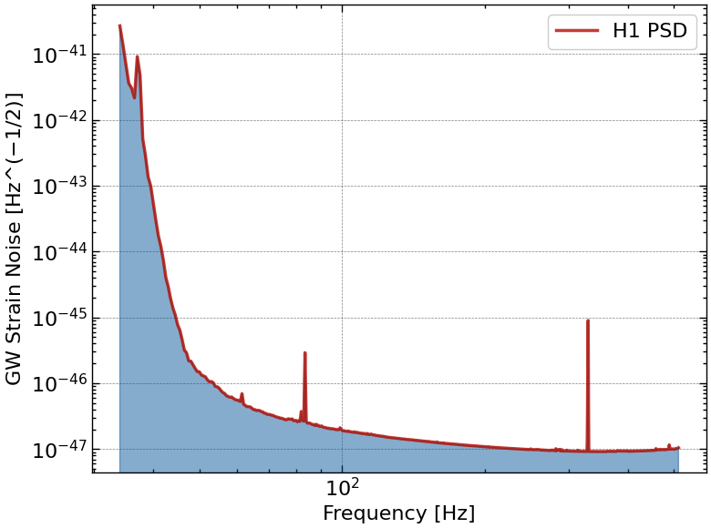

- Fisher Information Matrix for test GW params

> 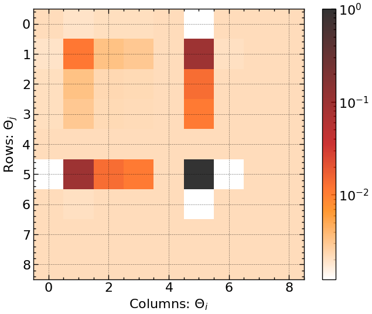

- Fisher Information Matrix wrt chirp mass and symmetric mass ratio

> 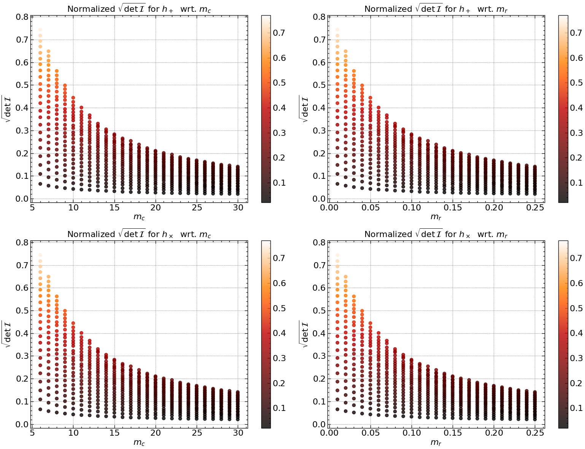

- Fisher Information Matrix contour plot

> 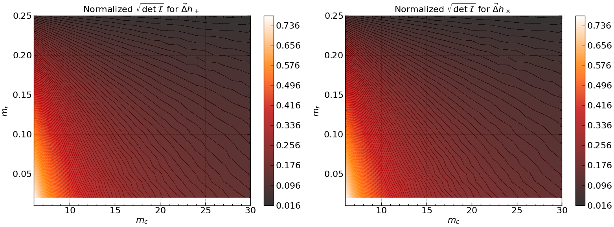

- Projected metric density contour plot

> 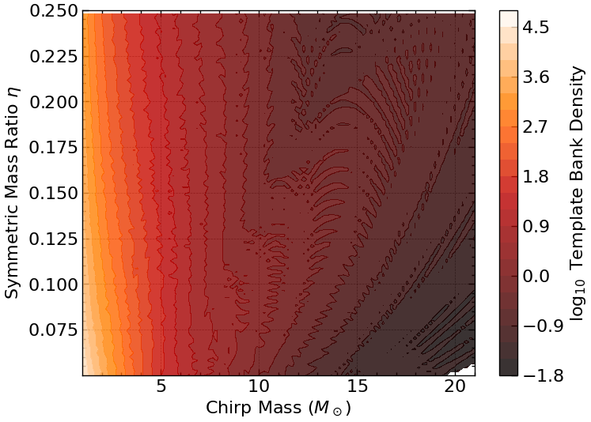
