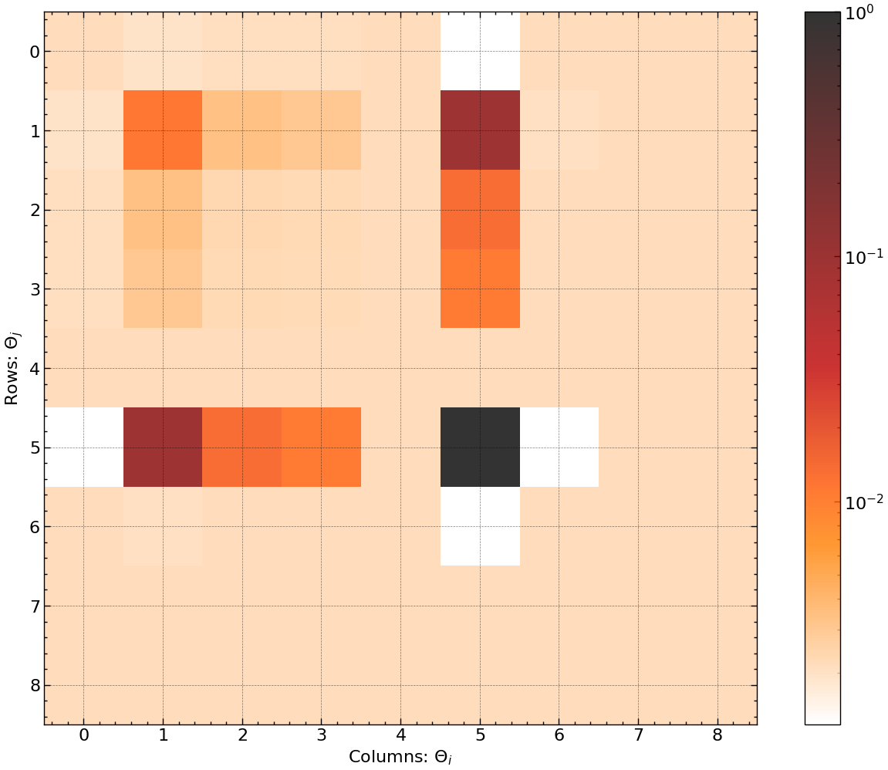

## gla-igr-msc-project
This is the degree project for *MSc in Astrophysics* at *University of Glasgow*
- Initialized: May 30, 2023
- Editted: July 26, 2023

## Environment
```WSL: Ubuntu```

## Dependecies
- ```jax```
- ```ripplegw```
- ```bilby```

## Test GW params
```python
m1, m2 = 36.0, 29.0
s1, s2 = 0.0, 0.0
dist_mpc = 40.0
c_time, c_phas = 0.0, 0.0
ang_inc, ang_pol = 0.0, 0.0
```

## Purpose
- Using ```jax``` and other packages to construct machine learning scripts
- Use ```jax``` with CUDA support for faster compilations
- Use normalizing flow for template bank placement problems

## File structure
```bash
.
├── LICENSE
├── README.md
├── data
│   ├── __init__.py
│   ├── gw_config.py
│   ├── gw_fisher.py
│   ├── gw_plotter.py
│   └── gw_ripple.py
├── figures
│   ├── fig_01_ripple_waveform.png
│   ├── fig_02_ripple_waveform_grad.png
│   ├── fig_03_bilby_psd.png
│   ├── fig_04_fim.png
│   ├── fig_05_fim_hp_mc_mr.png
│   └── fig_06_fim_mc_mr_contour.png
├── main.ipynb
└── main.py
```

## Active plots
- GW170817 waveform generated with ```ripplegw```
<p align="center">
  
</p>

- GW170817 waveform gradient plot with ```jax.vmap(jax.grad())```
<p align="center">
  
</p>

- PSD aLIGO noise curve with ```bilby```
<p align="center">
  
</p>

- Fisher Information Matrix for test GW params
<p align="center">
  
</p>

- Fisher Information Matrix wrt mc and mr
<p align="center">
  
</p>

- Fisher Information Matrix contour plot
<p align="center">
  
</p>
