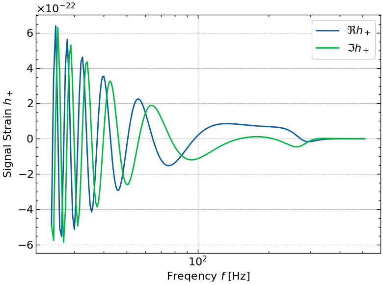

# gla-igr-msc-project

This is the degree project for *MSc in Astrophysics* at *University of Glasgow*.

- Initialized: May 30, 2023
- Edited: August 30, 2023

[//]: # "========================================================================"

## Purpose

Use normalizing flow for approximating gravitational wave template bank density

### Working scripts

- Template density for polarized GW waveform with respect to $\mathcal{M}$ and $\eta$
- Normalizing flow script - *under maintenance*

### Work in progress

- Normalizing flow script
- NF script packaging into vi_* files

[//]: # "========================================================================"

## Requirements

### Environment

- ```WSL: Ubuntu```
- ```Python 3.10```

### Dependecies

- ```jax```
- ```ripplegw```
- ```bilby```
- ```haiku```
- ```distrax```
- ```optax```
- ```scienceplots```

[//]: # "========================================================================"

## Theory background

### Waveform parameters

```python
# GW150914 Mock Param
m1, m2, s1, s2, dl, tc, phic, theta, phi = (
    36.0, 29.0, 0.0, 0.0, 40.0, 0.0, 0.0, 0.0, 0.0,
)
# Param for ripple waveform generation
mc, eta, s1, s2, dl, tc, phic, theta, phi = (
    28.0956, 0.2471, 0.0, 0.0, 40.0, 0.0, 0.0, 0.0, 0.0,
)
```

[//]: # "========================================================================"

## File structure

```bash
.
|-- LICENSE
|-- README.md
|-- data
|   |-- __init__.py
|   |-- __jaxcache__
|   |-- __pycache__
|   |-- gw_cfg.py
|   |-- gw_fim.py
|   |-- gw_plt.py
|   |-- gw_rpl.py
|   |-- vi_cfg.py
|   |-- vi_cls.py
|   |-- vi_dat.py
|   |-- vi_plt.py
|-- figures
|-- legacy
|-- main.py
|-- test.py
|-- results
```

[//]: # "========================================================================"

## Sample run

```python
"""
This is the master script for MSc project.

Created on Thu August 03 2023
"""
# %%
# Library import
# Set XLA resource allocation
import os
# Use jax and persistent cache
from jax.experimental.compilation_cache import compilation_cache as cc
# Custom packages
from src.template_flow import gw_fim, gw_plt, gw_rpl, vi_dat
from src.template_flow.gw_cfg import MCS, ETAS, PARAM_TEST, F_SIG, F_PSD
# Setup
os.environ['XLA_PYTHON_CLIENT_PREALLOCATE'] = 'false'
cc.initialize_cache("./data/__jaxcache__")

# %%
# First compilation test for sub modules
# Wavefor generation
HP = gw_rpl.waveform_plus_restricted(PARAM_TEST, F_SIG)
HC = gw_rpl.waveform_cros_restricted(PARAM_TEST, F_SIG)
# Gradient calculation
GP = gw_rpl.gradient_plus(PARAM_TEST)
GC = gw_rpl.gradient_cros(PARAM_TEST)
# FIM test statistics calculation
DETP = gw_fim.log_sqrt_det_plus(PARAM_TEST)
DETC = gw_fim.log_sqrt_det_cros(PARAM_TEST)
# First compilation - results checker
print(f"Test waveform HP.shape:{HP.shape} hc.shape:{HC.shape}")
print(f"Test gradient gp.shape:{GP.shape} gc.shape:{GC.shape}")
print(f"Test log density detp:{DETP:.4g} detc:{DETC:.4g}")

# %%
# FIM density calc params
FIM_PARAM = gw_fim.fim_param_build(MCS, ETAS)
print(f"fim_param.shape:{FIM_PARAM.shape}")

# %%
# New compilation for vectorized operaions
DENSITY_P = gw_fim.log_density_plus(FIM_PARAM).reshape([len(MCS), len(ETAS)])
DENSITY_C = gw_fim.log_density_cros(FIM_PARAM).reshape([len(MCS), len(ETAS)])

# %%
# Plot Generation
gw_plt.ripple_waveform(F_SIG, HP, waveform="hp")
gw_plt.ripple_waveform(F_SIG, HC, waveform="hc")
gw_plt.ripple_gradient(F_SIG, HP, HC, param="mc")
gw_plt.ripple_gradient(F_SIG, HP, HC, param="eta")
gw_plt.bilby_noise_psd(F_SIG, F_PSD)
gw_plt.log_fim_contour(MCS, ETAS, DENSITY_P, waveform="hp")
gw_plt.log_fim_contour(MCS, ETAS, DENSITY_C, waveform="hc")
gw_plt.log_fim_param(MCS, DENSITY_P, waveform= "hp",param= "mc")
gw_plt.log_fim_param(ETAS, DENSITY_P, waveform= "hp",param= "eta")
gw_plt.log_fim_param(MCS, DENSITY_C, waveform= "hc",param= "mc")
gw_plt.log_fim_param(ETAS, DENSITY_C, waveform= "hc",param= "eta")

# %%
# Flow training
vi_dat.train_flow()

# %%


```

[//]: # "========================================================================"

## Figures

### Active figures

- GW150914 simulated waveform with ```ripple.waveforms.IMRPhenomXAS.gen_IMRPhenomXAS_polar```

> 
> 

- GW150914 simulated gradient with ```jax.vmap(jax.grad())```

> 
> 

- Power Spectral Density of aLIGO from ```bilby```

> 

- Log template density

> 
> 

- Log template density at different range

> 
> 
> 
> 

- Normalising flow test

> 
> 

- Normalising flow training

> 
> 

### Legacy figures

- GW150914 waveform generated with ```ripplegw```

> 

- GW150914 waveform gradient plot with ```jax.vmap(jax.grad())```

> 

- PSD aLIGO noise curve with ```bilby```

> 

- Fisher Information Matrix for test GW params

> 

- Fisher Information Matrix wrt chirp mass and symmetric mass ratio

> 

- Fisher Information Matrix contour plot

> 

- Projected metric density contour plot

> 
